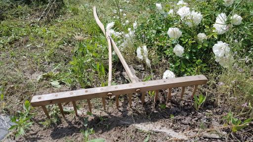

```{r setup, echo=FALSE, include=FALSE}
knitr::opts_chunk$set(cache = FALSE, echo = FALSE)
```

License
============

Source code for this document is available in GitHub repository: <https://github.com/gwierzchowski/dscapstone2/>.
Doucument with its source code is licensed under the [Creative Commons Attribution-NonCommercial-NoDerivs 3.0](http://creativecommons.org/licenses/by-nc-nd/3.0/) License.

Prerequisites
=============

R Packages
-----------

The document is prepared in **R Markdown** language and should be compiled using the **rmarkdown** package. 
This package can be installed from CRAN:
```{r eval=FALSE, echo=TRUE}
install.packages("rmarkdown")
```

To create this report I used following programs and R packages:

* R Base - version 3.6.1
* `tidyverse` - version 1.2.1
* `gridExtra` - version 2.3
* `h2o` - version 3.22.1.1
* R Studio
* Java - Oracle version "9.0.4"
* Linux based operating system

If some package is not installed on the system, report's build script will download and install it.
Some packages require C compiler to be installed on system, `h2o` package require Java in version 8 or higher to be installed.

```{r init-libs, cache=FALSE, include=FALSE}
if(!require(tidyverse)) install.packages("tidyverse")
if(!require(gridExtra)) install.packages("gridExtra")
library(tidyverse)
library(gridExtra)
```

H2O
-----------

In my work I wanted to use machine learning. Having bad experiece from previous MovieLens project, where some of my calculations were running for several hours using only 1 CPU core, and having very limited time for this project (about one week), I decided to try package which utilizes multithreading. One of the world leading frameworks for machine learning is *H2O*: <https://www.h2o.ai/>. This framework is writen in Java and there is tiny wrapper for R language available as `h2o` package. It works in following way. User from his R code loads the package and initalizes engine by invoking `h2o.init()` call. This either starts on local computer *H2O* server or with proper configuration may connect to server working on remote machine. Then user using *H2O* methods can load data or perform operations on it including tidying data, model creation, training and validation. Every such operation is being done at server side (by multithreaded Java code) and computer resources are taken at server side. This means that if all this is run on one box, it must have enough RAM memory to support both *H2O* server and R local script. I have run it on my personal laptop with 8 CPU cores and 16GB RAM - and it was quite sufficient for the task.

When *H2O* server is running, it is possible to connect to it from web browser and inspect objects, lookup job statuses, or even perform machine learning operations entirely from GUI, and at the end also export selected model as Java sorce code possible to deploy on other systems. During this project I however did not used any of those operations, doing everything completly in R.

Data
-----------

I decided to use one of the data files published on *Kaggle* web service. 
Data are described and can be downloaded from following page: <https://www.kaggle.com/keplersmachines/kepler-labelled-time-series-data>.
It is required to create free personal account on *Kaggle* service before it allows you to download data. I'm not authorized to re-distribute those data.
So if somebody wishes to run the code enbedded into this document, he should download the data files by himself.
Data are available for download as zip-file which containes two files: `exoTrain.csv` and `exoTest.csv`.
As names suggest they store training and test data and are in CSV format.
My program assumes that they are placed in `Data` subfolder of folder where this document source (i.e. .Rmd file) is stored.

Introduction
==============

Problem description
-------------------

The goal of the project is to try programatically recognize stars which could potentially have one or more exoplanets.
Here is extracted description from *Kaggle*:

> The data describe the change in flux (light intensity) of several thousand stars. Each star has a binary label of 2 or 1. 2 indicated that that the star is confirmed to have at least one exoplanet in orbit; some observations are in fact multi-planet systems.

> As you can imagine, planets themselves do not emit light, but the stars that they orbit do. If said star is watched over several months or years, there may be a regular 'dimming' of the flux (the light intensity). This is evidence that there may be an orbiting body around the star; such a star could be considered to be a 'candidate' system. Further study of our candidate system, for example by a satellite that captures light at a different wavelength, could solidify the belief that the candidate can in fact be 'confirmed'.

Model Evaluation Metrics
-------------------------

Evaluation metric measures how good is particular model in estimating results. There are many kinds of them in use. We have to select which one is most important for us, and which is most appropriate for our problem. Here we predict if particular star may have an orbiting exoplanet or not. This is so called binary clasification problem. Clasification - because our result belongs to fixed set of values. Binary - because we can have only two values of result. Additional characteristic of our problem is very big disproportion of one result over other in data (called *prevalence* in course materials) due to fact that that only small fraction of stars are suspected to have planets.

I have reviewed different metrics and found out that most recommended for such case is metric called MCC (Matthews correlation coefficient). Quoting Wikipedia:

> The MCC is in essence a correlation coefficient between the observed and predicted binary classifications; it returns a value between -1 and +1. A coefficient of +1 represents a perfect prediction, 0 no better than random prediction and -1 indicates total disagreement between prediction and observation.

It can be calculated from confusion matrix using formula (abbreviations as in course material):
$$\text{MCC}=\frac{TP\times TN-FP\times FN}{\sqrt{(TP+FP)(TP+FN)(TN+FP)(TN+FN)}}$$
Meaning "star has exoplanet" as positive I will be also paying attention to *Precision*. I imagine that a stream of observations is being at first exposed to "Exoplanet Hunting" models, and then stars appointed by models are further investigated. This investigation engages time of scientists, devices, power etc. so is costfull. Therefore it would be money lost if model would predict too much false positives. Precision can be calculaed as:
$$\text{PPV}=\frac{TP}{TP+FP}$$

Symbols
-------

In this report I will use following symbols:

- $\mu$ - mean of star flux observations
- $\sigma$ - standard deviation of star flux observations

Work plan
---------

As noted earlier I had very limited time for this project, so I did not spent too much time on searching how others approach the problem. I started to work rigth away with the data. From problem nature I knew that exoplanet should manifest as periodical and short flux level fluctuations (peaks to down). Here I specify my approach:

- load the data and review the graphs that shows measured flux levels; check both stars labeled as having and not having exoplanets
- try to find any pattern in exoplanet charts
- try to matematically describe this pattern, and code respective additional predictors.
- try to use machine learning algorithms to transform those predictors into clasification result
- select algorithm that up-front (with default parameters) produces best results and try to further tune it changing some parameters or using cross-validation to estimate them; use ensembling if there are few best models.

Data contain large number of columns (predictors). And those columns represent time-series observations, so I did not meant that some of them are generally more important then others or some relate on others. So I did not considered that any kind of processes like factorization, dimension reduction etc. would be approprate here. Also because of number of columns I did not think that using them directly as imputs for machine learning might give any good results.

Data Exploration
================

List of parameters used in predictors calculation process with assigned values:
```{r init-par, cache=TRUE, echo=TRUE}
# Parameters that affect document flow, performance etc.
H2O_NTHREADS <- -1       # (int) Number of threads for H2O Server (-1 - auto from OS)
H2O_MEM <- "12G"         # (text) Memory for H2O Server
WORK_WITH <- 1.0         # (float) Which fraction of data to work with 
                         #   (1.0 = work with full training data + load test data)
RANDOM_SAMPLES <- T      # (T/F) Set this to TRUE if you want to see different flux graphs 
                         #   at every time you generate document
SAMPLES_NO <- 18         # (int) Number of samples to present in document
SKIP_CALC <- T           # (T/F) Set this if you previously run calculations and saved them in file
                         #   .RData files needs to be manually placed in RData subfolder
ML_ALGORITHM_TEST_SIZE <- 1000 # We will check different ML algorithms with this size sample

# Parameters that affect model, calculations, etc.
OUTLINER_THRES_HI <- 5.0 # (float) Outliner if higher then OUTLINER_THRES_HI*sd
OUTLINER_THRES_LO <- 5.0 # (float) Outliner if lower then OUTLINER_THRES_LO*sd
NORMAL_THRES <- 1.7      # (float) Planet suspition if below NORMAL_THRES*sd
LEVELS_NO <- 4           # (int) We create predictors for this number of levels
                         #   from NORMAL_THRES to OUTLINER_THRES_LO
DISPLAY_LEVEL <- 1       # (int) Prepare charts for this level (1=NORMAL_THRES)
WINDOW_H <- 50           # (int) Minimal distance between fluxes minima to consider them as different
TEETH_DIST_ROUND <- 12   # (int) Used to round distances between teeths to group values
# Should be: 
#   0 < WORK_WITH <= 1.0
#   0 < NORMAL_THRES <= OUTLINER_THRES_LO
#   LEVELS_NO >= 1
#   1 <= DISPLAY_LEVEL <= LEVELS_NO
#   WINDOW_H > 1
#   TEETH_DIST_ROUND > 0 (1=no rounding)
#   ML_ALGORITHM_TEST_SIZE <= 5087 (no of records in training data)
```

```{r init-h2o, cache=FALSE, include=FALSE}
if(!require(h2o)) install.packages("h2o")
library(h2o)
h2o.init(nthreads = H2O_NTHREADS, # Number of threads -1 means use all cores on your machine
         max_mem_size = H2O_MEM)  # max mem size is the maximum memory to allocate to H2O
```

```{r prepare-data, cache=TRUE, include=FALSE}
if (as.integer(WORK_WITH) == 1) {
  exoTrainData_ext <- h2o.importFile("Data/exoTrain.csv")
  exoTestData <- h2o.importFile("Data/exoTest.csv")
} else {
  exoTrainData <- h2o.importFile("Data/exoTrain.csv")
  exoTestData <- NULL
  
  # Extract of data to work with during development/experimatation
  exoTrainData_ext <- exoTrainData[seq(1,as.integer(nrow(exoTrainData)*WORK_WITH)),]
}

# I want "exoplanet present" to be treated as positive by models
is_exo <- exoTrainData_ext$LABEL == 2
exoTrainData_ext$LABEL[is_exo] <- 0
  
# We are going to create binary classification model
# For that we have to convert our response column to factor, otherwice H2O will assume we are doing regression model.
exoTrainData_ext$LABEL <- as.factor(exoTrainData_ext$LABEL)
  
# indexes of colums with observations (flux values)
flux_idx <- seq(2, ncol(exoTrainData_ext))
  
# Try to normalize data (mean=0, sd=1)
#exoTrainData_ext_n <- exoTrainData_ext
# WARNING: After invoking h2o.scale, as.data.frame(exoTrainData_ext) returnes 0 rows
# Abandoned this concept
#h2o.scale(exoTrainData_ext_n)

# Calculate means of observations (using H2O call for speed)
means_ext <- as.vector(h2o.mean(exoTrainData_ext[,flux_idx], axis = 1, return_frame = T))

# Calculate standard deviation of observations and store it with mean in R data frame
# Notes:
# - unfortunately h2o.sd() does not calculate by rows
# - first convert to R data.frame, then calculate (R calculation directly on H2OFrame is very slow - I suppose message is sent to server at every access)
exoTrainData_ext_df <- as.data.frame(exoTrainData_ext)
sd_ext <- sapply(seq(1, nrow(exoTrainData_ext)), function(i) {
  sd(exoTrainData_ext_df[i,flux_idx])
})
exoTrainData_ext_df <- exoTrainData_ext_df %>%
  mutate(m = means_ext, sd = sd_ext)

# Extract of non-exoplanet star
exoTrainData_N_ext_df <- exoTrainData_ext_df %>%
  filter(LABEL == 1)

# Extract of exoplanet star
exoTrainData_E_ext_df <- exoTrainData_ext_df %>%
  filter(LABEL == 0)

# Do similar operations for test data if necessary
if (!is.null(exoTestData)) {
  is_exo <- exoTestData$LABEL == 2
  exoTestData$LABEL[is_exo] <- 0
  exoTestData$LABEL <- as.factor(exoTestData$LABEL)
  means_ext <- as.vector(h2o.mean(exoTestData[,flux_idx], axis = 1, return_frame = T))
  exoTestData_df <- as.data.frame(exoTestData)
  sd_ext <- sapply(seq(1, nrow(exoTestData)), function(i) {
    sd(exoTestData_df[i,flux_idx])
  })
  exoTestData_df <- exoTestData_df %>%
    mutate(m = means_ext, sd = sd_ext)
} else {
  exoTestData_df <- NULL
}
rm(is_exo, means_ext, sd_ext)
```

Data retrieval and preparation
------------------------------

To prevent this document expanding to large size I include here very little code listings. Full program code is avaialble in source file of this document (the .Rmd file).

Data were loaded using `h2o.importFile()` function which transformed it into `H2OFrame` object. It is possible to operate directly on such object, but I found it very slow when it comes to setting particular data inside records (probaly bacause of network message exchange associated to every such operation). Such H2O objects are rather intended to running bulk calculation operations at once which could be done entirely at H2O server side (like model training). So I then converted `H2OFrame` object into regular R `data.frame`, and performed operations on it using "well known" `dplyr` package. Once I performed all calculations and created new set of predictors I then transformed new `data.frame` object to `H2OFrame` and used this as input for creating and training models.

Basic characteristic of data
----------------------------

Structure of our input, raw data:
```{r, echo=TRUE}
h2o.str(exoTrainData_ext, list.len = 5)
```
Notes:

- `LABEL` is our result data; I did some pre-processing here and changed label 2 into 0, so now "0" stands for "is exoplanet", 1" - "no exoplanet"; this was done to force H2O models treat "exoplanet" as positive result.
- all other fields: `FLUX.*` are predictors - i.e. measured flux levels
- I did not investigated if they were pre-processed somehow, or why there are negative values, etc. My feeling was that absolute values does not matter that much, instead important is how they are changing - i.e. the shape of flux graph
- for this reason I also decided to not normalize them
- information: "10 obs. of  3198 variables" is little confusing, it is some kind of H2O cached value, real muber of observations is given in "attr(*, "nrow")"

Check if there are invalid observations inside the data:
```{r, echo=TRUE}
sum(is.na(exoTrainData_ext_df))
```

Proportion of positive vs. negative results:
```{r, echo=TRUE}
sum(exoTrainData_ext_df$LABEL == 0) / sum(exoTrainData_ext_df$LABEL == 1)
```

Initial overview of data
----------------------------

Now I wanted to see how the data looks like. Below I present samples from flux values of stars of each category: without and with exoplanets. `r SAMPLES_NO` stars of each category was randomly selected from training data set.

Actually I have done those charts several times, each time selecting different stars. I noticed that there are some quite rate observations that are unordinary high or low. I treated them as outliners possibly caused by some measure errors. I decided to remove them from data - but only those very high (i.e. bigger than `r OUTLINER_THRES_HI` times standard deviation), because I was worying that I can accidentally remove important "down peaks" which may designate a present exoplanet. I replaced outliner value with overall mean value. Better approach would be to take a local mean, but I did not do it for performance reasons, and also because - it does not really matter with this number of observations. 

Charts at left side present data before outliners removal, at right side - after. Yellow lines mark outliners cut-off level: $\mu\pm `r OUTLINER_THRES_HI`\sigma$. Red lines mark level that I will use later as cut-off for creating new predictors: $\mu\pm `r NORMAL_THRES`\sigma$

```{r remove-outliners}
if (SKIP_CALC && file.exists("RData/exoTrainData_ext_df2.RData")) {
  load("RData/exoTrainData_ext_df2.RData")
} else {
  exoTrainData_ext_df2 <- exoTrainData_ext_df
  tmp <-lapply(1:nrow(exoTrainData_ext_df), function(star) {
    out_idx <- c(FALSE, exoTrainData_ext_df[star, flux_idx] > exoTrainData_ext_df[star,]$m + OUTLINER_THRES_HI*exoTrainData_ext_df[star,]$sd)
    if (sum(out_idx) > 0) {
       #cat("Star", star, "removed", sum(out_idx), " outliners\n")
       # Note: <<- means that we are modifying variable from external scope
       exoTrainData_ext_df2[star, out_idx] <<- exoTrainData_ext_df[star,]$m
    }
  });
  # After we removed outliners, we recalculate mean and sd.
  means_ext2 <- sapply(seq(1, nrow(exoTrainData_ext_df2)), function(i) {
    mean(as.matrix(exoTrainData_ext_df2[i,flux_idx]))
  })
  sd_ext <- sapply(seq(1, nrow(exoTrainData_ext_df2)), function(i) {
    sd(exoTrainData_ext_df2[i,flux_idx])
  })
  exoTrainData_ext_df2 <- exoTrainData_ext_df2 %>%
    mutate(m = means_ext2, sd = sd_ext)
  rm(tmp, means_ext2, sd_ext)
  save(exoTrainData_ext_df2, file = "exoTrainData_ext_df2.RData")
}

# Extract of non-exoplanet star
exoTrainData_N_ext_df2 <- exoTrainData_ext_df2 %>%
  filter(LABEL == 1)

# Extract of exoplanet star
exoTrainData_E_ext_df2 <- exoTrainData_ext_df2 %>%
  filter(LABEL == 0)
```
```{r remove-outliners-TESTDATA, eval=FALSE}
# Nop: We are intentionally not removing outliners from test data
```

### No Exoplanet

```{r non-exoplanet-cleanup, cache = FALSE}
if (!RANDOM_SAMPLES) {
  set.seed(1970)
}
sample_N_idx <- sample(seq(1, nrow(exoTrainData_N_ext_df)), SAMPLES_NO)
p3 <- lapply(sample_N_idx, function(i) {
  yy <- as.numeric(exoTrainData_N_ext_df[i, flux_idx])
  m  <- as.numeric(exoTrainData_N_ext_df[i,]$m)
  sd <- as.numeric(exoTrainData_N_ext_df[i,]$sd)
  p1 <- data.frame(flux_idx,yy,m,sd) %>% ggplot() +
    geom_line(aes(x=flux_idx,y=yy)) +
    #geom_hline(aes(yintercept = m), col = "blue") +
    geom_hline(aes(yintercept = m + NORMAL_THRES*sd), col = "red") +
    geom_hline(aes(yintercept = m - NORMAL_THRES*sd), col = "red") +
    geom_hline(aes(yintercept = m + OUTLINER_THRES_HI*sd), col = "yellow") +
    geom_hline(aes(yintercept = m - OUTLINER_THRES_LO*sd), col = "yellow") +
    xlab("") + ylab("") +
    scale_y_continuous(breaks=NULL) +
    #annotate("text", x=-Inf, y=Inf, label=paste("NEx", i), hjust=-.2, vjust=2)
    ggtitle(paste("NEx #", i)) +
    theme(axis.text.y = element_blank(), text = element_text(size = 6))
  yy <- as.numeric(exoTrainData_N_ext_df2[i, flux_idx])
  m  <- as.numeric(exoTrainData_N_ext_df2[i,]$m)
  sd <- as.numeric(exoTrainData_N_ext_df2[i,]$sd)
  p2 <- data.frame(flux_idx,yy,m,sd) %>% ggplot() +
    geom_line(aes(x=flux_idx,y=yy)) +
    #geom_hline(aes(yintercept = m), col = "blue") +
    geom_hline(aes(yintercept = m + NORMAL_THRES*sd), col = "red") +
    geom_hline(aes(yintercept = m - NORMAL_THRES*sd), col = "red") +
    xlab("") + ylab("") +
    scale_y_continuous(breaks=NULL) +
    ggtitle("Cleaned") +
    theme(axis.text.y = element_blank(), text = element_text(size = 6))
  arrangeGrob(p1, p2, ncol=2)
})
marrangeGrob(p3, nrow=3, ncol=1, top = NULL)
```

### With Exoplanet

```{r exoplanet-cleanup, cache = FALSE}
if (!RANDOM_SAMPLES) {
  set.seed(1970)
}
sample_E_idx <- sample(seq(1, nrow(exoTrainData_E_ext_df)), SAMPLES_NO)
p3 <- lapply(sample_E_idx, function(i) {
  yy <- as.numeric(exoTrainData_E_ext_df[i, flux_idx])
  m  <- as.numeric(exoTrainData_E_ext_df[i,]$m)
  sd <- as.numeric(exoTrainData_E_ext_df[i,]$sd)
  p1 <- data.frame(flux_idx,yy,m,sd) %>% ggplot() +
    geom_line(aes(x=flux_idx,y=yy)) +
    geom_hline(aes(yintercept = m + NORMAL_THRES*sd), col = "red") +
    geom_hline(aes(yintercept = m - NORMAL_THRES*sd), col = "red") +
    geom_hline(aes(yintercept = m + OUTLINER_THRES_HI*sd), col = "yellow") +
    geom_hline(aes(yintercept = m - OUTLINER_THRES_LO*sd), col = "yellow") +
    xlab("") + ylab("") +
    scale_y_continuous(breaks=NULL) +
    ggtitle(paste("Ex #", i)) +
    theme(axis.text.y = element_blank(), text = element_text(size = 6))
  yy <- as.numeric(exoTrainData_E_ext_df2[i, flux_idx])
  m  <- as.numeric(exoTrainData_E_ext_df2[i,]$m)
  sd <- as.numeric(exoTrainData_E_ext_df2[i,]$sd)
  p2 <- data.frame(flux_idx,yy,m,sd) %>% ggplot() +
    geom_line(aes(x=flux_idx,y=yy)) +
    geom_hline(aes(yintercept = m + NORMAL_THRES*sd), col = "red") +
    geom_hline(aes(yintercept = m - NORMAL_THRES*sd), col = "red") +
    xlab("") + ylab("") +
    scale_y_continuous(breaks=NULL) +
    ggtitle("Cleaned") +
    theme(axis.text.y = element_blank(), text = element_text(size = 6))
  arrangeGrob(p1, p2, ncol=2)
})
marrangeGrob(p3, nrow=3, ncol=1, top = NULL)
```

Custom Predictors
=================

Looking at graphs presented in previous section I noticed that flux chart of stars that have exoplanets little bit resemble shape of "rake with teeth", where star flux decreases periodically (the teeths). So I will try to calculate predictors which will try to catch this effect. I will select abservations which are below certain level, then try to group the ones which are close together (parameter WINDOW_H) (meaning one planet pass before the star). Then I capture 3 statistics:

- number of such groups (aka teeths)
- standard deviation of distances between groups (the less, the more regular "teeths" are)
- number of rounded different distances between groups (the less, the more regular "teeths" are)

Then add them as my predictors. I'm doing this for configurable number of levels (parameter LEVELS_NO) from $\mu - `r NORMAL_THRES`\sigma$ to $\mu - `r OUTLINER_THRES_LO`\sigma$ in equal steps. For more details about used algorithm please look at provided source code.




Below charts present sample of stars (the same stars as in previous section) with marked one selected level: level #`r DISPLAY_LEVEL`. Red line mark level, and on the right there are listed first and third predicate (as above). One may optically verify it against the chart. Comparing non-exoplanet and exoplanet stars one may notice that those predictors used to be equal each other for non-exoplanet while are more frequently inequal for stars with exoplanets. This is promising result which I hope made those predictors usable by ML models.

```{r calculate-predictors}
# Create vector of Levels for which we create predictors
Levels <- seq(from=NORMAL_THRES, to=OUTLINER_THRES_LO, length.out = LEVELS_NO)

if (SKIP_CALC && file.exists("RData/exoTrainData_ext_df3.RData")) {
  load("RData/exoTrainData_ext_df3.RData")
} else {
  # Data frame to store our predictors
  exoTrainData_ext_df3 <- data.frame(LABEL=exoTrainData_ext_df2$LABEL, SD=exoTrainData_ext_df2$sd)
  
  tmp <-lapply(1:length(Levels), function(iLevel) {
    Level <- Levels[iLevel]
    
    # This matrix will store additional predictors wchich we will add to exoTrainData_ext_df3
    # col1: count od teeths 
    # col2: sd(distances between teeths) 
    # col3: count of distinct values of rounded distances between teeths
    pred <- matrix(nrow=nrow(exoTrainData_ext_df3), ncol = 3) 
    
    # This matrix will store minimal peaks of mesured flux
    # In below code and comments we call:
    #   peak - every flux value below threshold (< m - NORMAL_THRES*sd)
    #   teeth - minimal peak within each group (i.e. inside WINDOW_H frame)
    # col1: flux_idx(i.e. time) - for which flux value is minimal; 
    # col2: flux_idx(i.e. time) - current; 
    # col3: flux value; 
    # col4: distance to previous teeth (for first distance to last modulo length)
    # col5: col4 rounded by TEETH_DIST_ROUND - we do count_distinct againt this
    teeths <- matrix(nrow=length(flux_idx), ncol = 5) 
    tmp <-lapply(1:nrow(exoTrainData_ext_df2), function(star) {
      # Note: This probably could be improved: every next level is lower then previous one
      #       so we could use some values calculated in previous loops.
      #
      # Create temporary data frame and matrix to help in performing calculations
      # dplyr will filter-out necessary points faster then if we'd do it in plain R here.
      flux_peeks_df <- data.frame(idx = flux_idx, flux = as.numeric(exoTrainData_ext_df2[star, flux_idx])) %>%
        filter(flux < exoTrainData_ext_df2[star,]$m - Level*exoTrainData_ext_df2[star,]$sd)
      idx <- 1
      teeths[,] <<- 0
      if (nrow(flux_peeks_df) > 0) {
        tmp <-lapply(1:nrow(flux_peeks_df), function(flx) {
          if (flx == 1) {
            # We are at first peak, store candidate values; idx should be 1 here
            teeths[idx,] <<- c(flux_peeks_df[flx,]$idx, flux_peeks_df[flx,]$idx, flux_peeks_df[flx,]$flux, 0, 0)
          } else {
            # Check if we are considering this paek to be the same teeth
            if (abs(teeths[idx,2] - flux_peeks_df[flx,]$idx) > WINDOW_H) {
              # Too far from previous peak, initiate new teeth, store candidate values
              if (idx > 1) {
                teeths[idx,4] <<- teeths[idx,1] - teeths[idx-1,1]
                teeths[idx,5] <<- as.integer(teeths[idx,4] / TEETH_DIST_ROUND) * TEETH_DIST_ROUND
              }
              idx <<- idx + 1
              teeths[idx,] <<- c(flux_peeks_df[flx,]$idx, flux_peeks_df[flx,]$idx, flux_peeks_df[flx,]$flux, 0, 0)
            } else {
              # Check if this peak is below mimimal so far within the same teeth
              teeths[idx,2] <<- flux_peeks_df[flx,]$idx
              if (flux_peeks_df[flx,]$flux < teeths[idx,3]) {
                # We got better peek to represent teeth
                teeths[idx,1] <<- flux_peeks_df[flx,]$idx
                teeths[idx,3] <<- flux_peeks_df[flx,]$flux
              }
            }
          }
        })
      }
      if (idx > 1) {
        teeths[idx,4] <<- teeths[idx,1] - teeths[idx-1,1]
        teeths[idx,5] <<- as.integer(teeths[idx,4] / TEETH_DIST_ROUND) * TEETH_DIST_ROUND
        teeths[1,4] <<- teeths[1,1] + length(flux_idx) - teeths[idx,1]
        teeths[1,5] <<- as.integer(teeths[1,4] / TEETH_DIST_ROUND) * TEETH_DIST_ROUND
      }
      pred[star, 1] <<- ifelse(teeths[1,1] > 0, idx, 0)
      pred[star, 2] <<- ifelse(idx > 1, sd(teeths[1:idx,3]), NA) 
      pred[star, 3] <<- ifelse(idx > 1, nrow(distinct(data.frame(teeths[1:idx,4]))), NA) 
    })
    nn <- names(exoTrainData_ext_df3)
    exoTrainData_ext_df3 <<- exoTrainData_ext_df3 %>%
      mutate(pred[,1], pred[,2], pred[,3])
    nn <- c(nn, 
            paste("TEETHS", iLevel, sep = ""), 
            paste("TEETHS_SD", iLevel, sep = ""), 
            paste("TEETHS_UNIQ", iLevel, sep = ""))
    names(exoTrainData_ext_df3) <<- nn
  })
  
  # Clean unnecessary data and save results for future
  rm(teeths, pred, tmp)
  save(exoTrainData_ext_df3, file = "exoTrainData_ext_df3.RData")
}

# Extract of non-exoplanet star
exoTrainData_N_ext_df3 <- exoTrainData_ext_df3 %>%
  filter(LABEL == 1)

# Extract of exoplanet star
exoTrainData_E_ext_df3 <- exoTrainData_ext_df3 %>%
  filter(LABEL == 0)
```

```{r calculate-predictors-TESTDATA}
# TODO: Make it better - remove code duplication
# Do similar operations for test data if necessary (see comments in previous section)
if (!is.null(exoTestData_df)) {
  if (SKIP_CALC && file.exists("RData/exoTestData_df3.RData")) {
    load("RData/exoTestData_df3.RData")
  } else {
    exoTestData_df3 <- data.frame(LABEL=exoTestData_df$LABEL, SD=exoTestData_df$sd)
    
    tmp <-lapply(1:length(Levels), function(iLevel) {
      Level <- Levels[iLevel]
      
      pred <- matrix(nrow=nrow(exoTestData_df3), ncol = 3) 
      
      teeths <- matrix(nrow=length(flux_idx), ncol = 5) 
      tmp <-lapply(1:nrow(exoTestData_df), function(star) {
        flux_peeks_df <- data.frame(idx = flux_idx, flux = as.numeric(exoTestData_df[star, flux_idx])) %>%
          filter(flux < exoTestData_df[star,]$m - Level*exoTestData_df[star,]$sd)
        idx <- 1
        teeths[,] <<- 0
        if (nrow(flux_peeks_df) > 0) {
          tmp <-lapply(1:nrow(flux_peeks_df), function(flx) {
            if (flx == 1) {
              teeths[idx,] <<- c(flux_peeks_df[flx,]$idx, flux_peeks_df[flx,]$idx, flux_peeks_df[flx,]$flux, 0, 0)
            } else {
              if (abs(teeths[idx,2] - flux_peeks_df[flx,]$idx) > WINDOW_H) {
                if (idx > 1) {
                  teeths[idx,4] <<- teeths[idx,1] - teeths[idx-1,1]
                  teeths[idx,5] <<- as.integer(teeths[idx,4] / TEETH_DIST_ROUND) * TEETH_DIST_ROUND
                }
                idx <<- idx + 1
                teeths[idx,] <<- c(flux_peeks_df[flx,]$idx, flux_peeks_df[flx,]$idx, flux_peeks_df[flx,]$flux, 0, 0)
              } else {
                teeths[idx,2] <<- flux_peeks_df[flx,]$idx
                if (flux_peeks_df[flx,]$flux < teeths[idx,3]) {
                  teeths[idx,1] <<- flux_peeks_df[flx,]$idx
                  teeths[idx,3] <<- flux_peeks_df[flx,]$flux
                }
              }
            }
          })
        }
        if (idx > 1) {
          teeths[idx,4] <<- teeths[idx,1] - teeths[idx-1,1]
          teeths[idx,5] <<- as.integer(teeths[idx,4] / TEETH_DIST_ROUND) * TEETH_DIST_ROUND
          teeths[1,4] <<- teeths[1,1] + length(flux_idx) - teeths[idx,1]
          teeths[1,5] <<- as.integer(teeths[1,4] / TEETH_DIST_ROUND) * TEETH_DIST_ROUND
        }
        pred[star, 1] <<- ifelse(teeths[1,1] > 0, idx, 0)
        pred[star, 2] <<- ifelse(idx > 1, sd(teeths[1:idx,3]), NA)
        pred[star, 3] <<- ifelse(idx > 1, nrow(distinct(data.frame(teeths[1:idx,4]))), NA)
      })
      nn <- names(exoTestData_df3)
      exoTestData_df3 <<- exoTestData_df3 %>%
        mutate(pred[,1], pred[,2], pred[,3])
      nn <- c(nn, 
              paste("TEETHS", iLevel, sep = ""), 
              paste("TEETHS_SD", iLevel, sep = ""), 
              paste("TEETHS_UNIQ", iLevel, sep = ""))
      names(exoTestData_df3) <<- nn
    })
    # No need to make filtered data frames for test set.
    rm(flux_peeks_df, teeths, pred, tmp)
    save(exoTestData_df3, file = "exoTestData_df3.RData")
  }
} else {
  exoTestData_df3 <- NULL
}
```


## No exoplanet

```{r non-exoplanet-predictors, cache = FALSE, warning=FALSE}
LevelDisplay <- Levels[DISPLAY_LEVEL]

# No sampling - we print the same stars like before
p3 <- lapply(sample_N_idx, function(i) {
  yy <- as.numeric(exoTrainData_N_ext_df2[i, flux_idx])
  m  <- as.numeric(exoTrainData_N_ext_df2[i,]$m)
  sd <- as.numeric(exoTrainData_N_ext_df2[i,]$sd)
  p1 <- data.frame(flux_idx,yy,m,sd) %>% 
    ggplot() +
    geom_line(aes(x=flux_idx,y=yy)) +
    #geom_hline(aes(yintercept = m + LevelDisplay*sd), col = "red") +
    geom_hline(aes(yintercept = m - LevelDisplay*sd), col = "red") +
    annotate("segment", x=0, xend=WINDOW_H, y=min(yy), yend=min(yy), colour="brown", 
      arrow=arrow(ends="both", angle=90, length=unit(.1,"cm"))) +
    annotate("text", x=WINDOW_H, y=min(yy), label=paste(WINDOW_H, "(WINDOW_H)"), hjust=-.09, colour="brown", size=2) +
    xlab("") + ylab("") +
    scale_y_continuous(breaks=NULL) +
    ggtitle(paste("NEx #", i)) +
    theme(axis.text.y = element_blank(), text = element_text(size = 6))
  count <- as.numeric(exoTrainData_N_ext_df3[i,paste("TEETHS", DISPLAY_LEVEL, sep = "")])
  unique <- as.numeric(exoTrainData_N_ext_df3[i,paste("TEETHS_UNIQ", DISPLAY_LEVEL, sep = "")])
  sd <- as.numeric(exoTrainData_N_ext_df3[i,paste("TEETHS_SD", DISPLAY_LEVEL, sep = "")])
  p2 <- data.frame(pred=c("Count", "Distances"),val=c(count,unique)) %>% 
    ggplot(aes(x=pred, y=val)) +
    geom_bar(stat="identity") +
    geom_text(aes(label=val), vjust=1.5, colour="white") +
    xlab("") + ylab("") +
    scale_y_continuous(breaks=NULL) +
    ggtitle(paste("Teeths, sd:", format(sd, digits=2, nsmall=2))) + #, nsmall=2 digits=2
    theme(axis.text.y = element_blank(), axis.ticks=element_blank(), text = element_text(size = 6))
  arrangeGrob(p1, p2, ncol=2, widths = c(4,1))
})
marrangeGrob(p3, nrow=3, ncol=1, top = NULL)
#ggsave("p3.pdf", marrangeGrob(p3, nrow=3, ncol=1, top = NULL))
```

## With Exoplanet

```{r exoplanet-predictors, cache = FALSE, warning=FALSE}
# No sampling - we print the same stars like before
p3 <- lapply(sample_E_idx, function(i) {
  yy <- as.numeric(exoTrainData_E_ext_df2[i, flux_idx])
  m  <- as.numeric(exoTrainData_E_ext_df2[i,]$m)
  sd <- as.numeric(exoTrainData_E_ext_df2[i,]$sd)
  p1 <- data.frame(flux_idx,yy,m,sd) %>% 
    ggplot() +
    geom_line(aes(x=flux_idx,y=yy)) +
    #geom_hline(aes(yintercept = m + LevelDisplay*sd), col = "red") +
    geom_hline(aes(yintercept = m - LevelDisplay*sd), col = "red") +
    annotate("segment", x=0, xend=WINDOW_H, y=min(yy), yend=min(yy), colour="brown", 
      arrow=arrow(ends="both", angle=90, length=unit(.1,"cm"))) +
    annotate("text", x=WINDOW_H, y=min(yy), label=paste(WINDOW_H, "(WINDOW_H)"), hjust=-.09, colour="brown", size=2) +
    xlab("") + ylab("") +
    scale_y_continuous(breaks=NULL) +
    ggtitle(paste("Ex #", i)) +
    theme(axis.text.y = element_blank(), text = element_text(size = 6))
  count <- as.numeric(exoTrainData_E_ext_df3[i,paste("TEETHS", DISPLAY_LEVEL, sep = "")])
  unique <- as.numeric(exoTrainData_E_ext_df3[i,paste("TEETHS_UNIQ", DISPLAY_LEVEL, sep = "")])
  sd <- as.numeric(exoTrainData_E_ext_df3[i,paste("TEETHS_SD", DISPLAY_LEVEL, sep = "")])
  p2 <- data.frame(pred=c("Count", "Distances"),val=c(count,unique)) %>% 
    ggplot(aes(x=pred, y=val)) +
    geom_bar(stat="identity") +
    geom_text(aes(label=val), vjust=1.5, colour="white") +
    xlab("") + ylab("") +
    scale_y_continuous(breaks=NULL) +
    ggtitle(paste("Teeths, sd:", format(sd, digits=2, nsmall=2))) + 
    theme(axis.text.y = element_blank(), axis.ticks=element_blank(), text = element_text(size = 6))
  arrangeGrob(p1, p2, ncol=2, widths = c(4,1))
})
marrangeGrob(p3, nrow=3, ncol=1, top = NULL)
```

Checking different ML algorithms
=================================

Now we will check different machine learning algorithms provided by H2O framework afainst our data set with prepared custom predictors. All models were trained using default parameters.

```{r convert-to-h2o, cache=FALSE, include=FALSE}
# Convert R data frame to H2O frame in order to use for model building
exoTrainData_ext_h2o3 <- as.h2o(exoTrainData_ext_df3)

if (as.integer(WORK_WITH) == 1) {
  #atest_sample_idx <- sample(1:nrow(exoTrainData_ext_h2o3), ML_ALGORITHM_TEST_SIZE)
  #exoTrainData_ext_atest_h2o3 <- exoTrainData_ext_h2o3[atest_sample_idx,]
  exoTrainData_ext_atest_h2o3 <- exoTrainData_ext_h2o3[1:ML_ALGORITHM_TEST_SIZE,]
} else {
  exoTrainData_ext_atest_h2o3 <- exoTrainData_ext_h2o3
}

# Partition the data into training, validation and test sets
splits <- h2o.splitFrame(data = exoTrainData_ext_atest_h2o3, 
                         ratios = 0.8,  #partition data into 80%, 20% chunks
                         seed = -1)
exoTrainTrainData_ext_atest_h2o3 <- splits[[1]]
exoTrainValidData_ext_atest_h2o3 <- splits[[2]]
if (!is.null(exoTestData_df3)) {
  exoTestData_h2o3 <- as.h2o(exoTestData_df3)
} else {
  exoTestData_h2o3 <- NULL
}

result_h2o  <- "LABEL"
predict_h2o <- setdiff(names(exoTrainData_ext_h2o3), result_h2o)
rm(splits)
```

## Generalized Linear Model
```{r glm, include=FALSE}
glm_mod0 <- h2o.glm(x = predict_h2o, 
                    y = result_h2o, 
                    training_frame = exoTrainTrainData_ext_atest_h2o3,
                    model_id = "glm_mod0",
                    family = "binomial",
                    seed = 1)
glm_perf0 <- h2o.performance(model = glm_mod0,
                             newdata = exoTrainValidData_ext_atest_h2o3)
```

Obtained Result:
```{r glm-results, include=TRUE}
print(glm_perf0@metrics$max_criteria_and_metric_scores)
```

## Random Forest

```{r rf, include=FALSE}
rf_mod0 <- h2o.randomForest(x = predict_h2o, 
                    y = result_h2o, 
                    training_frame = exoTrainTrainData_ext_atest_h2o3,
                    model_id = "rf_mod0",
                    seed = 1)
rf_perf0 <- h2o.performance(model = rf_mod0,
                             newdata = exoTrainValidData_ext_atest_h2o3)
```

Obtained Result:
```{r rf-results, include=TRUE}
print(rf_perf0@metrics$max_criteria_and_metric_scores)
```

## Gradient Boosting Machine
```{r gbm, include=FALSE}
gbm_mod0 <- h2o.gbm(x = predict_h2o, 
                    y = result_h2o, 
                    training_frame = exoTrainTrainData_ext_atest_h2o3,
                    model_id = "gbm_mod0",
                    seed = 1)
gbm_perf0 <- h2o.performance(model = gbm_mod0,
                             newdata = exoTrainValidData_ext_atest_h2o3)
```

Obtained Result:
```{r gbm-results, include=TRUE}
print(gbm_perf0@metrics$max_criteria_and_metric_scores)
```

## Deep Learning
```{r dl, include=FALSE}
dl_mod0 <- h2o.deeplearning(x = predict_h2o, 
                    y = result_h2o, 
                    training_frame = exoTrainTrainData_ext_atest_h2o3,
                    model_id = "dl_mod0",
                    seed = 1)
dl_perf0 <- h2o.performance(model = dl_mod0,
                             newdata = exoTrainValidData_ext_atest_h2o3)
```

Obtained Result:
```{r dl-results, include=TRUE}
print(dl_perf0@metrics$max_criteria_and_metric_scores)
```

## Summary

Here is summary of results of checked models:

| Model  | Matthews CC | Mean Accuracy |
|:----------|:--------------------|:--------------------|
| GLM  | `r glm_perf0@metrics$max_criteria_and_metric_scores$value[8]` | `r glm_perf0@metrics$max_criteria_and_metric_scores$value[10]` |
| RF   | `r rf_perf0@metrics$max_criteria_and_metric_scores$value[8]` | `r rf_perf0@metrics$max_criteria_and_metric_scores$value[10]` |
| GBM  | `r gbm_perf0@metrics$max_criteria_and_metric_scores$value[8]` | `r gbm_perf0@metrics$max_criteria_and_metric_scores$value[10]` |
| DL   | `r dl_perf0@metrics$max_criteria_and_metric_scores$value[8]` | `r dl_perf0@metrics$max_criteria_and_metric_scores$value[10]` |

The best perfoming algorithm seems to be **Gradient Boosting Machine** so I will use it in my final model.

Result
===========

## Final Gradient Boosting Machine Model

```{r rf-final, include=FALSE}
if (!is.null(exoTestData_h2o3)) {
  # rf_mod1 <- h2o.randomForest(x = predict_h2o, 
  #                     y = result_h2o, 
  #                     training_frame = exoTrainData_ext_h2o3,
  #                     model_id = "rf_mod1")
  #                     #validation_frame = exoTrainValidData_ext_h2o3,
  #                     #ntrees = 100)
  # rf_perf1 <- h2o.performance(model = rf_mod1,
  #                              newdata = exoTestData_h2o3)
  gbm_mod1 <- h2o.gbm(x = predict_h2o, 
                      y = result_h2o, 
                      training_frame = exoTrainData_ext_h2o3,
                      model_id = "gbm_mod1")
                      #validation_frame = exoTrainValidData_ext_h2o3,
                      #ntrees = 100)
  gbm_perf1 <- h2o.performance(model = gbm_mod1,
                               newdata = exoTestData_h2o3)
} else {
  # NoP - nothing to do
}
```

Parameters of used model:
```{r rf-final-params, include=TRUE}
if (!is.null(gbm_perf1)) {
#  print(rf_mod1@parameters)
  print(gbm_mod1@parameters)
}
```

Obtained Result:
```{r rf-final-results, include=TRUE}
if (!is.null(gbm_perf1)) {
#  print(rf_perf1)
  print(gbm_perf1)
}
```


Conclusion
===========

I managed to build model which obtained not bad MCC metrics against test data: `r gbm_perf1@metrics$max_criteria_and_metric_scores$value[8]`. It was able to correctly recognize 2 out of 5 stars with exoplanets, but more importantly did not raise any false alarms when checking at least 600 stars without exoplanets (see confusion matrix above).

## Ideas for further work

The time for course final capstone excercise is limited, and also the time that I can sacrifice on it is very limited.
Because of those constraints I did not managed to realize some ideas that I initally intended. Most important are:

- I have set the model parameters (listed in "Data Exploration" section) using intuition, common sense and little experiments. Some of them should be really estimated by true trials using cross validation on parameters grid.
- Deeper investigate machine learning algorithms and possible to use parameters. Perform more experiments in this area.
- Try to use ensembling algorithm using best performing ML algorithms.
- I have a feeling that deep learning algorithm may produce good results when applied to raw data (instead of my calculated predictors). This should be verified. Flux chart might be treated as image (of rake) to recognize.
- There is a mathematical discipline that deals with functions distributing into harmonic compoments. I have a feeling that it could be somehow applied here. I mean that flux charts of stars with exoplanets are more cyclic and should be better approximated by harmonic components.
- Some Internet / literature reaserch sould be done, as our problem seems to be well known and kind of hot topic.

## Final word

I would like to take opportunity and express my appreciation to all persons imvolved into preparation of this excelent "Data Scientists Proffesional" series of courses, espacially to _prof. Rafael A. Irizarry_ - the main author. I am also very grateful that this course and all materials have been made publicly available .

I have learned a lot. Gained also some hands-on experiance with R programming language which I did not know before.
I like very much RStudio programming environment, but honestly I'm not very big fan of R language, espacially because of its strange 
syntax, unclear type system, sometimes not clear help descriptions for packages, but mostly for slowness and one-thread approach.
Looking forward I think I will be trying to use languages like Julia or Python for my next data science related learning efforts. I think I will continue learning of H2O framework. I may be also continuing work on this exoplanet project - check out my github repository for future updates.

```{r cleanup, cache=FALSE, include=FALSE}
h2o.shutdown(prompt = F)
```
